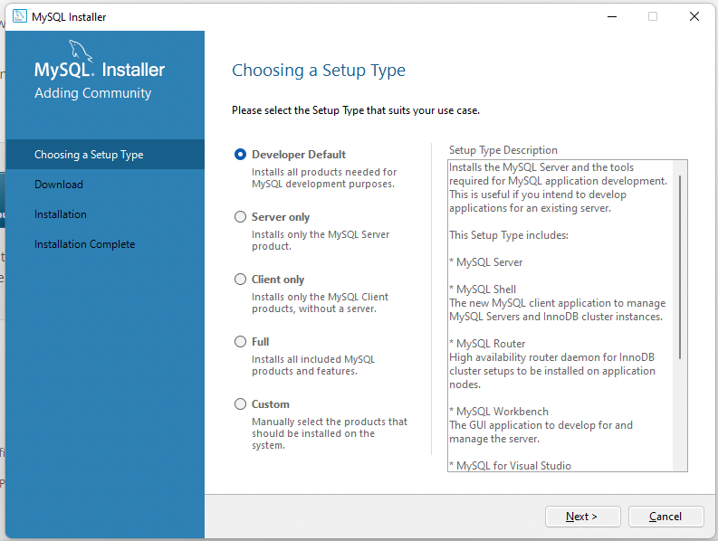
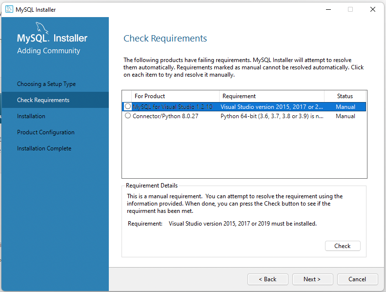
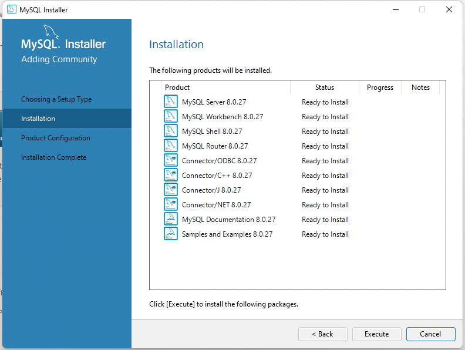
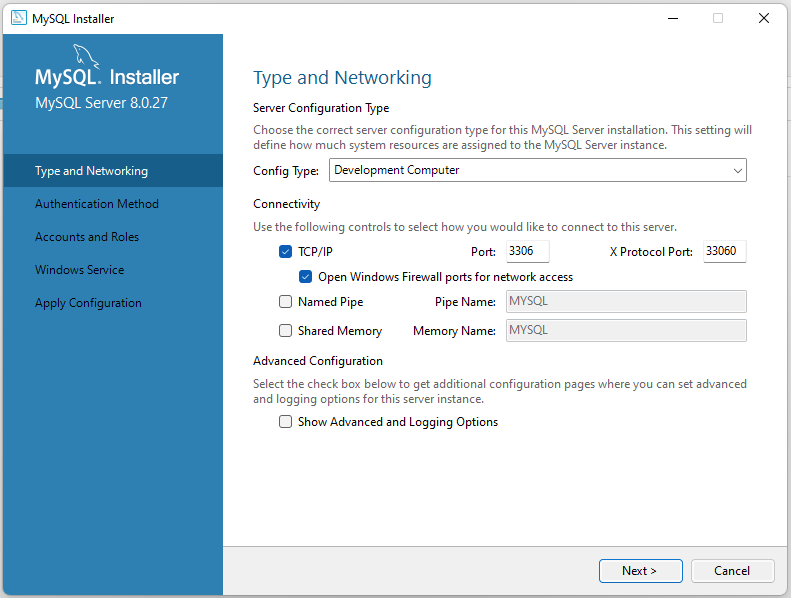
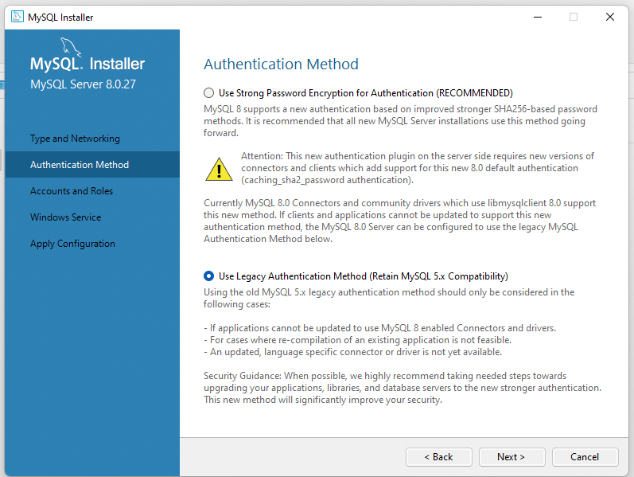
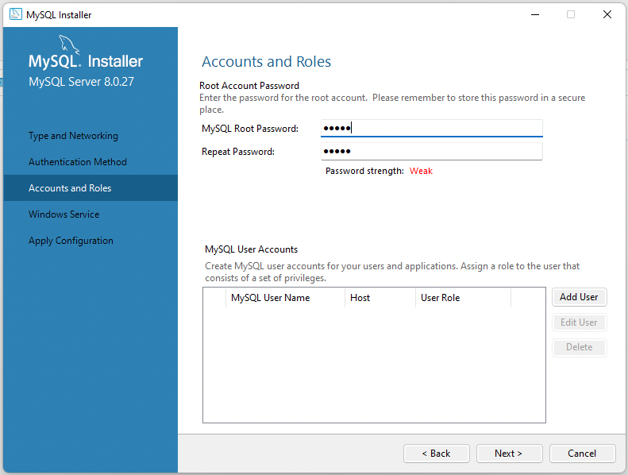
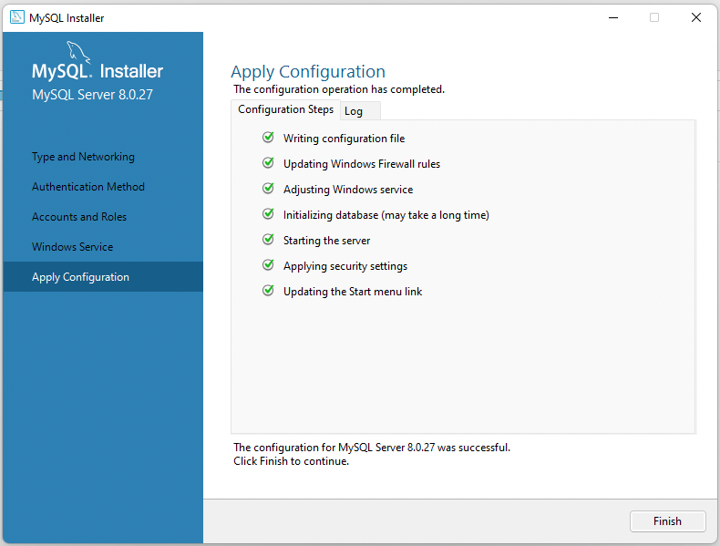

# Let's set up MySQL

* Download MySQL 2019 Community Server: [https://dev.mysql.com/downloads/mysql/](https://dev.mysql.com/downloads/mysql/)
* Downloaded msi file and double click on it.
* Select basic set up:

---

---

---

---

  
---

---

---

In the next steps you will be asked to do post configuration. Just use default settings and when you will be asked to enter password for root user - enter your password and press next.

