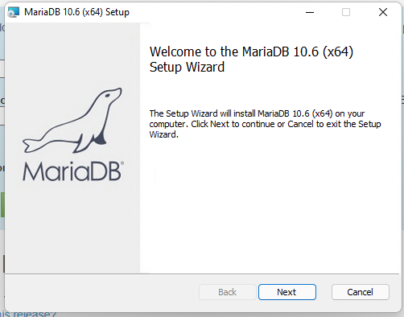
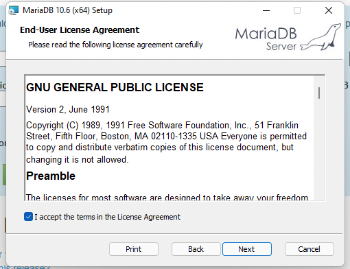
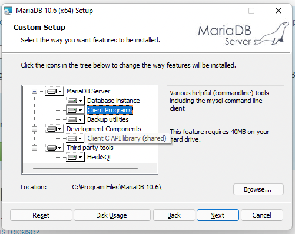
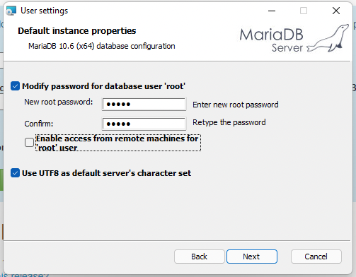
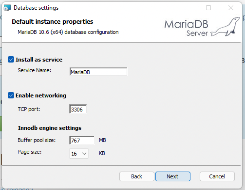
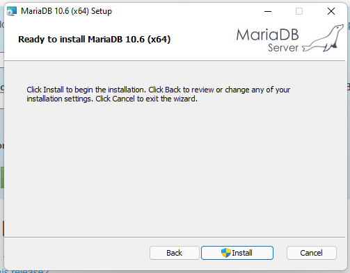

# Let's set up MySQL (MariaDB)

* Download MariaDB Community Server: [https://mariadb.org/download/?t=mariadb&p=mariadb&r=10.6.5&os=windows&cpu=x86_64&pkg=msi&m=uab](https://mariadb.org/download/?t=mariadb&p=mariadb&r=10.6.5&os=windows&cpu=x86_64&pkg=msi&m=uab)
* Downloaded msi file and double click on it.
* Select basic set up:

---

---

---

---

  
---

