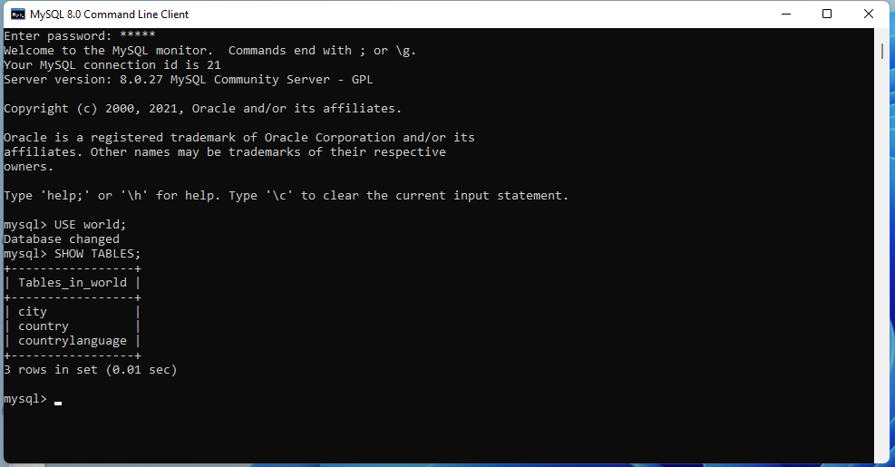

# Let's inspect our MySQL server with CLI

* To be sure that MySQL works open MySQL command line tool:

* Enter you root password:

* Enter statement to inspect databases:

* Enter statement to select database:

* Enter statement to inspect what tables exists in database:

* Inspect table:

