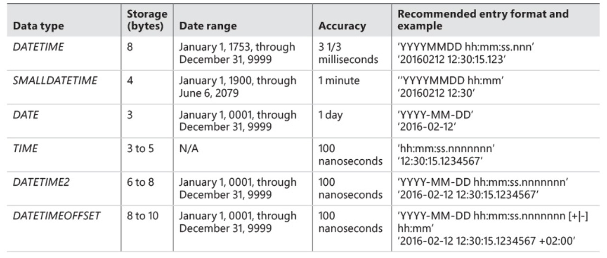

# Working with date and time data

T-SQL supports six date and time data types: two legacy types called *DATETIME* and *SMALLDATETIME*, and four later additions (since SQL Server 2008) called *DATE*, *TIME*, *DATETIME2*, and *DATETIMEOFFSET*.



Let's look at example:

```sql
SELECT orderid, custid, empid, orderdate
FROM Sales.Orders
WHERE orderdate = '20160212';
```

SQL Server recognizes the literal ‘20160212’ as a character-string literal and not as a date and time literal, but because the expression involves operands of two different types, one operand needs to be implicitly converted to the other’s type.

Casting is done implicitly here, but we can specify it by using *CAST*

```sql
SELECT orderid, custid, empid, orderdate
FROM Sales.Orders
WHERE orderdate = CAST('20160212' AS DATE);
```

We can format date:

```sql
SELECT CONVERT(DATE, '02/12/2016', 101);
SELECT PARSE('02/12/2016' AS DATE USING 'en-US');
```

## Date and time functions

*GETDATE, GETUTCDATE, SYSDATETIME, SYSUTCDATETIME, SYSDATETIMEOFFSET, CAST, CONVERT, SWITCHOFFSET, AT TIME ZONE, TODATETIMEOFFSET, DATEADD, DATEDIFF and DATEDIFF_BIG, DATEPART, YEAR, MONTH, DAY, DATENAME, various FROMPARTS functions, and EOMONTH.*

## Current date and time

*GETDATE, CURRENT_TIMESTAMP, GETUTCDATE, SYSDATETIME, SYSUTCDATETIME, and SYSDATETIMEOFFSET.*

```sql
SELECT
  GETDATE()           AS [GETDATE],
  CURRENT_TIMESTAMP   AS [CURRENT_TIMESTAMP],
  GETUTCDATE()        AS [GETUTCDATE],
  SYSDATETIME()       AS [SYSDATETIME],
  SYSUTCDATETIME()    AS [SYSUTCDATETIME],
  SYSDATETIMEOFFSET() AS [SYSDATETIMEOFFSET];
```

```sql
SELECT
  CAST(SYSDATETIME() AS DATE) AS [current_date],
  CAST(SYSDATETIME() AS TIME) AS [current_time];
```
